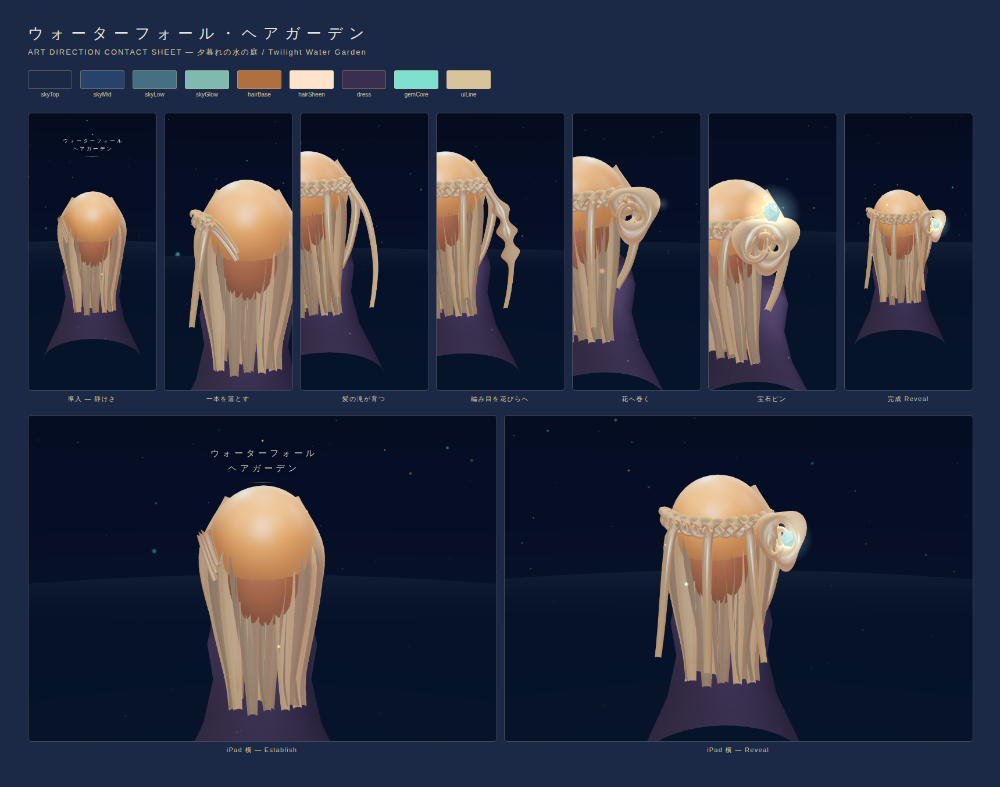

# ウォーターフォール・ヘアガーデン

髪の流れを編み、庭を育てるように一輪の花を咲かせる、触れる短編アニメーション。
iPhone / iPad のモバイルブラウザ向け（縦・横対応、一指操作、60〜120秒）。



## 遊びの流れ

1. ウォーターフォール編み — 交差し、一本を落とし、新しい一本を拾う
2. 編み目を外へ引いて花びらに広げる
3. 螺旋になぞって一輪の花へ巻く
4. 露のしずくのような宝石を中央へ差し込む
5. カメラが引き、髪の滝と花を眺める。もう一度。

## 開発

```bash
npm install
npm run dev        # http://localhost:5173
npm run typecheck  # tsc --noEmit
npm test           # vitest（編み込み数学）
npm run build      # 型検査 + 本番ビルド
```

検証ツール（devサーバー起動中に）:

```bash
node tools/playtest.mjs      # 実ジェスチャーで全ループを通すE2E
npm run shots                # ゴールデンスクリーンショット再生成
npm run contact-sheet        # docs/ART_DIRECTION_CONTACT_SHEET.png 再生成
```

## エージェント/開発者へ

**コードに触れる前に [`AGENTS.md`](AGENTS.md) を読むこと。**
美術方向は `docs/DESIGN_CONSTITUTION.md` と `docs/STYLE_LOCK.json` で固定されている。
