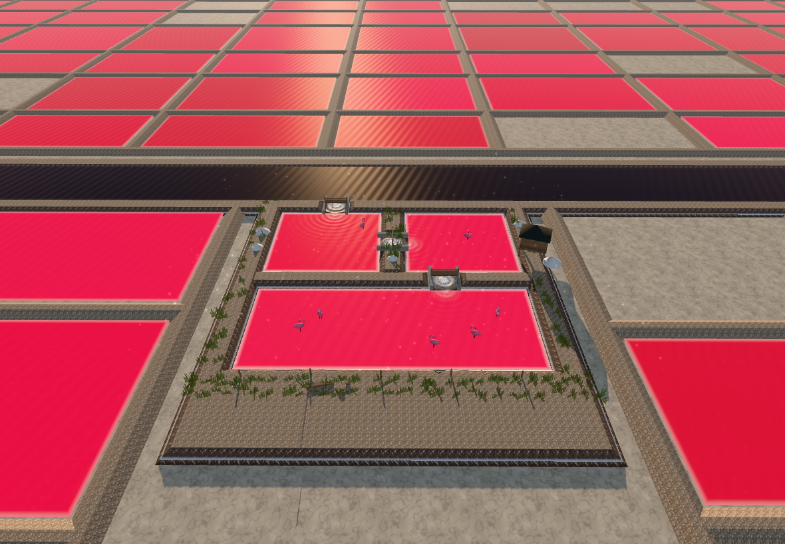

# さらさら！ ピンク湖のしおづくり

4 歳の女の子が iPhone・iPad の Safari で遊べる、指いっぽんのモバイル Web ゲームです。

しょっぱいお水を浅い池に入れて、ピンクの池をつくります。
文字も、点数も、制限時間も、ゲームオーバーもありません。



## 遊びかた（説明は要りません）

1. からっぽの池を見る
2. 水門の板を指で上へ引く（どこを触っても開きます）
3. 水が流れこみ、池がうっすらピンクになる
4. 次の池へ送る
5. 太陽を触る／画面をなぞって風を送ると、水が減って色が濃くなる
6. ぐっと高い視点に切り替わり、鮮やかなピンクの池が画面いっぱいに広がる
7. まるい矢印を触ると、もういちど

## ピンクの扱いについて

ピンクは塗料でも色選びでもありません。**塩分が濃くなった水そのものの色**として扱っています。

水の色は塩分濃度 `uSalinity`（0〜1）だけで決まり、
海の暗い青緑 → 濁った灰色 → 淡いサーモン → 珊瑚色 → 鮮やかなマゼンタピンク
へと連続的に遷移します（`src/water.js` の `BRINE_STOPS`）。

濃度は、水が減った分だけ上がります。

- 池が満ちる … 濃度はその池の基準値（0.20〜0.32）まで上がる ＝ うっすらピンク
- 太陽を触る … 蒸発が進み、水位が下がり、濃度が上がる
- 風を送る … さらに蒸発が進む
- 最終的に濃度 0.86〜0.98 ＝ 鮮やかなピンク

海と取水路の水は最後まで塩分 0 のままで、暗い青緑を保ちます。
この対比があるので、ピンクが「濃くなった塩水の色」として読み取れます。

浅いところでは白い塩床が透けて明るく見え、岸には塩の縁取りが析出します。
畦の法面には、水が引いたあとの白い塩の跡が残ります。

## 4 歳児向けの設計

- **一本指だけ**。2 本目以降のポインタは無視するので、手のひらが当たっても壊れません。
- **文字なし**。「上へ引く」「触る」「なぞる」は、繰り返し動く 3D の矢印と指の点だけで伝えます。
- **失敗できない**。水門は、板をつまんで引いても、上へなぞっても、画面のどこかを軽く触っても開きます。
- **待たせない**。5 秒でヒントが大きくなり、17 秒で自動的に次へ進みます。
- **止まらない**。制限時間・点数・ゲームオーバーはありません。

## 画面と奥行き

CSS の擬似 3D ではなく、透視投影・遮蔽・視差・実ジオメトリを持つ WebGL 空間です。

- **近景** … 手前の畦に置かれた板の山、木桶、塩掻きレーキ、杭とロープ、風で揺れる草
- **中景** … 樋門（コンクリートの袖壁、上げ下げする杉板、掴む横木）、高床の作業小屋、塩の山
- **遠景** … 地平線まで続く塩田のグリッド、取水路、海、霞んだ山並み

寸法は実物を基準にしています。畦の高さ 0.78 m・天端幅 1.4〜2.8 m、池の水深 0.19〜0.42 m、
水門の板厚 7 cm、小屋の床高 1.3 m。太陽は低い位置（仰角 11.5°）に置いてあるので、
畦の輪郭が逆光で立ち、水面には太陽へ伸びるきらめきの道ができます。
空気遠近は `FogExp2`（密度 0.0021）で、遠景ほど空の色に溶けます。

## カメラ

位置ではなく〈注視点＋方向＋収めたい半径〉で指定し、毎フレーム画面比から距離を逆算します
（`src/cameraRig.js`）。iPhone 縦・iPhone 横・iPad 縦・iPad 横のどの比率でも構図が破綻しません。

操作中は水門と水の流れが分かる近中景、クライマックスでは仰角 40° の高い俯瞰、
そのあと少し起こして地平線まで続く塩田を見せます。

## 動かす

```bash
npm install
npm run dev        # 開発サーバ
npm run build      # 本番ビルド（dist/）
npm run preview    # ビルド結果を確認
```

外部アセットはありません。テクスチャはすべて起動時に canvas 上で手続き的に生成し、
効果音は WebAudio で合成します。読み込み待ちがなく、モバイル回線でも初回表示が速くなります。

## 確認

```bash
npm run test:e2e
```

iPhone 縦横・iPad 縦横の 4 通りで、水門操作 → 水の流れ → 池が満ちる → 色が濃くなる →
全面ピンクの俯瞰 → 再プレイ、までの一周を通します。
あわせて、画面回転時の構図と、二本目の指が無視されることも確認します。

> クラウド実行時の描画は SwiftShader（ソフトウェア）です。
> フレームレート・アニメーションの滑らかさ・最終的な絵の品質は、
> ハードウェア GPU のある実機または CI で確認してください。
> E2E が確認しているのは進行・状態・水位・塩分濃度といった数値と、描画が成立することです。

開発中に見た目を確かめるには、端末を指定してスクリーンショットを撮れます。

```bash
npm run preview &
node tools/shoot.mjs iphone-portrait     # shots/ に一周ぶんが出力される
node tools/shoot.mjs ipad-landscape
```

## 構成

| ファイル | 役割 |
| --- | --- |
| `src/main.js` | 起動、レンダラ設定、リサイズ、メインループ |
| `src/game.js` | 進行（工程の状態機械）、蒸発と塩分濃度の計算、入力の解釈 |
| `src/world.js` | 地形、池、台形断面の畦、樋門 |
| `src/water.js` | かん水のシェーダ（塩分濃度 → 色、波、塩の縁取り、泡） |
| `src/farfield.js` | 地平線まで続く塩田群と、ピンクが広がる波 |
| `src/props.js` | 近景の道具、作業小屋、草、フラミンゴ、山並み |
| `src/sky.js` | 空のグラデーション、太陽、雲 |
| `src/cameraRig.js` | 画面比に応じて構図を保つカメラ |
| `src/hint.js` | 文字を使わない 3D の指示マーカー |
| `src/input.js` | 一本指だけを扱うポインタ処理 |
| `src/audio.js` | WebAudio による効果音の合成 |
| `src/textures.js` | canvas による手続き的テクスチャ |
