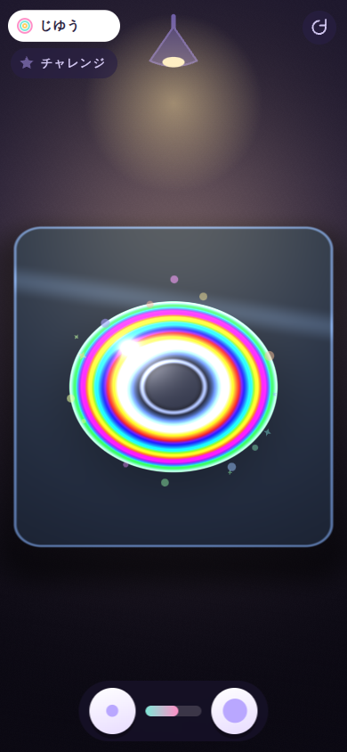

# おして ひろがる にじのわ研究室

4 歳の子が iPhone / iPad のブラウザで遊べる、ニュートンリング（Newton's rings）の光あそび。

まるいレンズを平らなガラスに置き、ライトをつけると虹色の同心円があらわれる。
指でそっと押すと、輪っかが外へ広がる。指を離すと、もどる。それだけ。



## あそびかた

1. ▶ を押す
2. ガラスの上をさわる → レンズが置かれる
3. ランプを押す → 虹の輪があらわれる
4. レンズを押す → 輪が広がる。離すと、もどる

モードは 2 つ。左上のチップで切り替える。

| モード | できること |
| --- | --- |
| **じゆう** | レンズの大きさを ⚪ / ⬤ ボタンで 5 段階に変えられる。小さいレンズは太い輪が数本、大きいレンズは細い輪がたくさん |
| **チャレンジ** | 点線の輪が出る。押して虹の輪をそこまで届かせると、おほしさまが 1 つ。3 つそろうと紙ふぶき。そのあとまた最初から |

## 4 歳児向けに決めたこと

- **一指だけ**。2 本目以降の指は無視する（`pointerId` を 1 つに固定）
- **文字は最小**。ひらがなの短い語のみ。操作はすべてアイコンと絵で示す
- **失敗がない**。時間切れ・ゲームオーバー・減点はない。チャレンジは押せばいつか必ず届くよう、
  届かない時間が続くと目標がこっそり手前に寄ってくる（`Game.target()`）
- **どこを押してもよい**。レンズの中心から離れても効きは 15% しか落ちない
- **すぐ変わる**。触れた瞬間に押しぐあいが 0.34 まで跳ね、ばねで少し行き過ぎてから落ち着く。
  「押した感じ」が最初のフレームから返る

## 見た目のしくみ

本物の干渉計算はしない。フラグメントシェーダ 1 枚（`src/shaders.ts`）で、
空気層の厚みに相当する位相 `ph` を赤・緑・青の 3 波長ぶん `sin²` でサンプルするだけ。

```
ph = uK * (r² - rc²)            r  … レンズ内の半径 (0..1)
                                rc … 接触面の半径。押すほど大きい
I  = sin²(ph), sin²(1.18·ph), sin²(1.44·ph)     (λ の比は 650 : 550 : 450 nm)
```

これだけで「中心が黒く、外へ虹がくり返し、遠くほど白っぽい」という
白色光のニュートンリングらしい帯になる。押すと `uK` が下がって輪が外へ広がり、
同時に `rc` が育って中央の黒い点が大きくなる。

細かすぎて 1 ピクセルに何本も入る領域は、位相の勾配を解析的に求めて
灰色へ溶かしている（`fpp` / `aa`）。`fwidth` を使わないので拡張機能に依存しない。

カメラは真上からわずかに傾けた固定視点。3D は使わず、y 方向を `SQUASH = 0.82` で
つぶすだけで斜め上から見た楕円にしている。

## 画面の向き

縦・横どちらでも遊べる。キャンバスは常に全画面で、操作系だけが浮いている。

- **縦**: ランプが上、大きさボタンが下
- **横**: 大きさボタンを右端に逃がし、縦の余白をレンズに回す（レンズが約 3 割大きくなる）

レイアウトはランプと大きさボタンの実測値から毎回組み直すので、
セーフエリアやノッチの違いをそのまま吸収する。

## 開発

```bash
npm install
npm run dev        # http://127.0.0.1:5173
npm run build      # 型チェック + 本番ビルド (dist/)
npm run preview    # ビルド結果を http://127.0.0.1:4173 で確認
npm run test:e2e   # Playwright (Chromium / iPhone 縦・横 / iPad)
```

### URL パラメータ

| パラメータ | 意味 |
| --- | --- |
| `?fast=1` | devicePixelRatio を 1 に固定し、粒の数を減らす（非力な端末・CI 用） |
| `?test=1` | rAF で時間を進めず `__nijinowa.step(秒)` だけで進める。CSS アニメーションも止める |
| `?seed=N` | キラキラの乱数の種 |

### テスト用フック

`window.__nijinowa` から `state()` / `step(秒)` / `press(on, x, y)` / `mode()` / `size()` などを
呼べる。E2E は実時間に頼らず、この決定論的なステップで進める。

```bash
node tools/shots.mjs shots          # 4 機種ぶんの一周プレイを画像に残す
ONLY=iphone-p node tools/shots.mjs  # 1 機種だけ
```

## 対応環境

iOS Safari / iPadOS Safari を第一に、WebGL1 のみを使う。
依存パッケージは 0（ビルド時のみ Vite / TypeScript）。本番の JS は gzip で約 11 KB。

- WebGL のコンテキストロストから復帰する
- WebGL が使えない場合はタイトルにその旨を出す
- 音は Web Audio のオシレータのみ。素材ファイルなし。最初のタップで解錠する
- ダブルタップ拡大・ピンチ・バウンススクロールを止めてある

## 既知の制約

CI（Claude Code on the web）の Chromium は SwiftShader によるソフトウェア描画のため、
**FPS・アニメーションのなめらかさ・最終的な見た目の品質はそこでは判断していない**。
E2E が確かめているのは、状態遷移・レイアウト・入力・描画が成立することまで。
実機の描画性能は GPU のある環境で確認すること。
